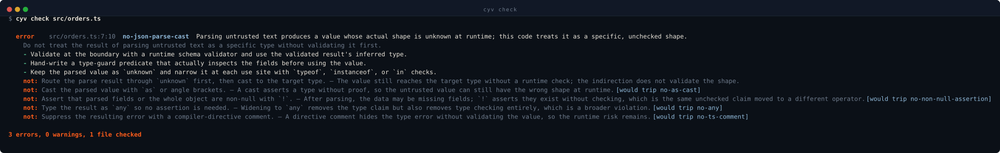
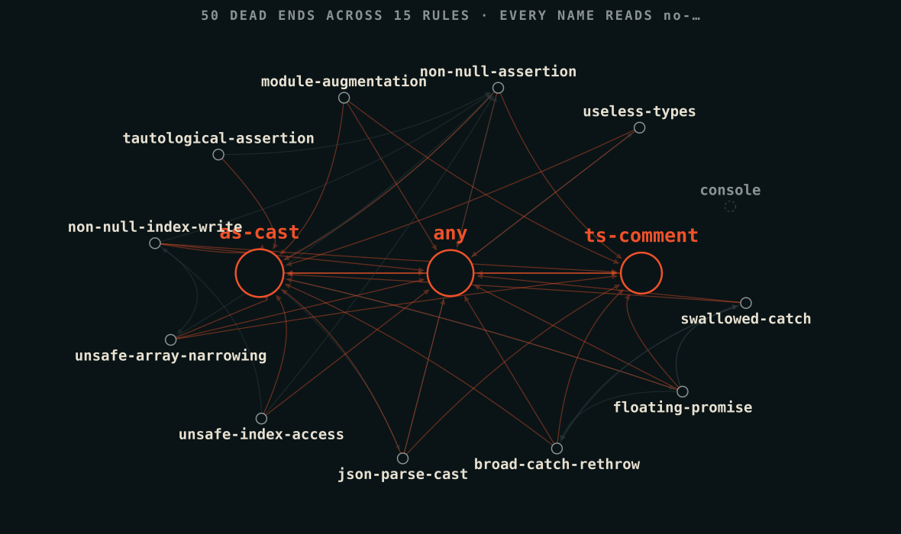
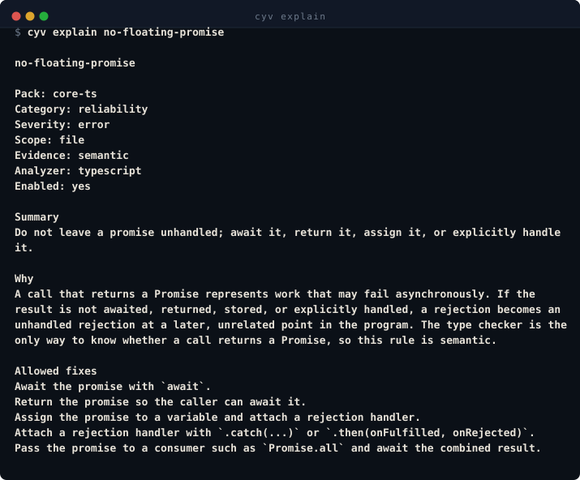

# checkyourvibe

Code standards that hold when an agent is writing the code.

- **A compiler decides, not a model.** Same input, same verdict, every run.
- **Multi-agent, multi-model.** Runs on the subscriptions you already hold, and takes the smallest
  model that can do each job. No API key, no token cost.
- **Pluggable on every axis.** A language, a rule pack, an agent, an executor. The core learns none
  of them.
- **Every finding names the fixes that work, and the shortcuts that don't.**

<p align="center">
  
</p>

## Why a rules file wasn't enough

You wrote the `CLAUDE.md`. It worked for a while, then the context got long and the agent stopped
caring. Stronger wording didn't help. It can't: you're asking a sampling process to be reliable.

checkyourvibe still writes guidance into your agent's format, and that part is still advisory. But
the guidance is not what enforces the standard. A compiler is, one layer below, where the model
can't reach it.

```
  advisory    instructions, MCP     agent may read it, may ignore it
  fast loop   agent hook            feedback at the moment of the edit
  guarantee   git hook, CI          ts-morph, Roslyn, ast, syn
```

The bottom layer runs on the diff regardless. It doesn't care whether the agent read the guidance,
agreed with it, or wrote the code at all. The model gets no vote on whether its output passes.

That's why the top two layers are allowed to be flaky. Nothing depends on them.

## Rules that cover each other

<p align="center">
  
</p>

Reach for `as` to escape `no-any` and `no-as-cast` is waiting. Reach for `@ts-ignore` to escape
that and `no-ts-comment` is there. Fourteen TypeScript rules, forty-seven declared dead ends between
them, and every one names the rule it lands on.

An agent reading a finding sees both lists: what to do, and which shortcuts lead somewhere worse.

## Runs on your subscriptions

Metered agent work gets expensive fast. Flat-rate plans don't, and most people building this way
hold several. Each capped, each idle most of the time.

Ships with **Claude Code, Codex, Cursor, Gemini and Antigravity**, through each one's own hook,
instructions, guidance and MCP surfaces.

### One subscription drives. The rest are capacity.

```
   you ──▶ orchestrator          ┌──▶ Claude Code    2 of 3 running
           (one subscription)    │
                │                ├──▶ Codex          0 of 2 running
                ├── which agent? ┤
                │                ├──▶ Cursor         cooling down
                └── which model? │
                                 └──▶ Gemini         0 of 2 running
                    ▲
              localhost dashboard: what's running, where, and why
```

**Which agent** spreads the load. The scheduler knows exactly how many dispatches each lane has in
flight, because it started them. A lane that begins refusing work goes into cooldown until its next
success. No agent CLI reports its remaining quota, so you won't see a fake percentage bar here.

**Which model** is per task, and it is always the smallest one that can do the job. A flat-rate plan
is not an unmetered one: every subscription bounds what it will do inside a window, and the biggest
model on a lane reaches that bound soonest. Spending it on a rename across forty files is how you
find the lane empty when a design decision shows up.

So nothing asks for the top model as a matter of course. A task declares what kind of work it is,
each lane declares which of its models can handle that kind, and the dispatch takes the smallest
one. If the gates fail, it retries one step up and records why. Escalation follows a real failure
rather than a guess about one.

An executor never requires a metered key. Metered lanes are opt-in by name, labelled billed, and
never an automatic fallback or escalation target.

## `cyv explain`

<p align="center">
  
</p>

Pack, what the rule reads, which analyzer owns it, whether it's enabled here, and which other rules
point at it.

## Install

```sh
git clone <this repository>
cd checkyourvibe
./install.sh          # or ./install.ps1 on Windows
```

Then, from the project you want to check:

```sh
cyv init              # detect your agents, write the glue
cyv check --all       # see where you stand
cyv install-hooks     # wire the git backstop
cyv install-ci        # detect your CI system and offer it a gate
```

`cyv install-hooks --with-drift-check` adds a second gate to the hook: `cyv doctor`,
so a commit is refused when the generated agent glue no longer matches what `cyv init`
would write. It is off unless asked for, skipped automatically part-way through a
rebase or merge, and skipped for one commit with `CYV_SKIP_DRIFT=1 git commit`.

`cyv install-ci` reads the files actually in the repository — `.github/workflows/`,
`.gitlab-ci.yml`, `Jenkinsfile`, `.circleci/config.yml`, `azure-pipelines.yml`,
`bitbucket-pipelines.yml`, `.travis.yml` — plus the lockfile and hook framework, and
plans a gate for what it found. "No CI system detected" is a statement, not a failure.
Nothing is written without a plan, a diff and a confirmation, and an existing config
file is appended to inside a managed block rather than replaced.

[docs/getting-started.md](docs/getting-started.md) walks the first run end to end.

## Rules

Analyzers are modules you add. The core is the engine and the protocol; it carries no language of
its own, so it needs no .NET SDK, no Rust toolchain and no Python to install. Add the ones you want
and `checkyourvibe.json` names them.

Four exist today: TypeScript (ts-morph), C# (Roslyn), Python (`ast`), Rust (`syn`). A fifth needs no
change to the core. They speak a versioned JSON contract, so listing what rules exist never boots a
language toolchain.

No rule names a framework, ORM, cloud provider or logging library. A rule whose guidance names a
package stops being true when you switch packages.

**`core-ts`**

| Rule | Catches |
|---|---|
| `no-any` | `any`, written or inferred |
| `no-as-cast` | `x as T`, angle brackets, double casts through `unknown` |
| `no-non-null-assertion` | `!` on values, fields and variable declarations |
| `no-ts-comment` | `@ts-ignore` and `@ts-expect-error` in any comment style |
| `no-useless-types` | `object`, `Function`, `{}` |
| `no-console` | Global `console`; takes `allowedMethods` |
| `no-swallowed-catch` | A `catch` that neither rethrows, reports nor handles |
| `no-broad-catch-rethrow` | `catch (e) { throw e; }` |
| `no-floating-promise` | A Promise neither awaited, returned nor handled |

**`strict-boundaries`** (data crossing into the program)

| Rule | Catches |
|---|---|
| `no-json-parse-cast` | Casting `JSON.parse` or `res.json()` without validating |
| `no-unsafe-index-access` | Reading an index that may not exist |
| `no-unsafe-array-narrowing` | `Array.isArray` on `unknown`, which narrows to `any[]` |
| `no-non-null-index-write` | Writing past the end of an array |

**`test-quality`**

| Rule | Catches |
|---|---|
| `no-tautological-assertion` | An assertion comparing a value to itself |

**`core-cs`** — `no-dynamic`, `no-unchecked-cast`, `no-null-forgiving`, `no-empty-catch`

**`core-py`** — `no-bare-except`, `no-mutable-default-arg`, `no-assert-for-validation`, `no-star-import`

**`core-rust`** — `no-unwrap`, `no-panic-in-library`, `no-unsafe-block`, `no-ignored-result`

Write your own with `cyv new-rule`. It scaffolds the rule, its manifest, a fixture pair and a test,
and won't let the dead-end list ship empty.

## Adopting an existing codebase

You won't pass on the first run. Take a baseline, gate new code against it, burn down the rest.

```sh
cyv baseline                     # record what's already there
cyv check --since-baseline       # only new violations
cyv baseline --status            # what's left, and where
```

Every run still reports the deferred count, so a green check never means the debt vanished.

Suppressions carry a reason and an expiry. There's no bare ignore directive. Full path in
[docs/adoption.md](docs/adoption.md).

## Beyond the CLI

```sh
cyv dashboard        # browse every rule and the interlock, in a browser
cyv doctor           # check generated agent glue hasn't drifted
cyv check --sarif    # GitHub code scanning, with the dead ends attached
cyv watch            # re-run as files change
```

`cyv dashboard` reads static manifests only. No analyzer runs to render the page, so you can read
every rule before installing a compiler.

## Licence

MIT.
