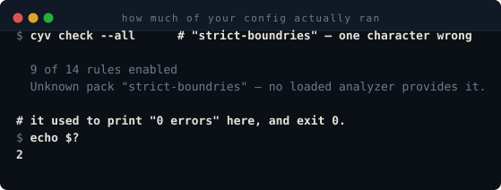
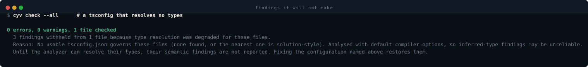

# Getting started

This page is for someone who has just arrived and wants to know whether
checkyourvibe is worth the next twenty minutes. It is honest about what works
today, because an unfinished tool described as finished wastes more time than one
described as unfinished.

## What works today and what does not

**What works today:**

- Installing and running from a local clone — including running it in a project
  that has nothing to do with checkyourvibe. `cyv init` there configures the
  TypeScript analyzer from the clone and `cyv check` reports real findings; see
  "Where the analyzer comes from" below for how the reference stays portable.
- The TypeScript analyzer: fourteen rules across three packs — nine in
  `core-ts`, four in `strict-boundaries`, and one so far in `test-quality`
  (spec 0030, still in progress). (Twenty-six is the total across all four
  analyzers; only the TypeScript ones are enabled by default. These counts
  move often — check `packages/*/analyzer.manifest.json` or `cyv check --all`
  for the current figures rather than trusting a number written down here.)
- `cyv init`, `cyv check`, `cyv explain`, `cyv install-hooks`, `cyv doctor`,
  `cyv verify-analyzer`, and the git pre-commit backstop.

**What does not work yet:**

- There is no published npm package you can `npx` today. The workspace packages
  still carry `private: true` and their inter-package dependencies still use
  `workspace:*`, which a registry cannot resolve. The release tooling is in
  place, but the release decision has not been made. See T5010.
- The C#, Python, and Rust analyzers exist and pass conformance, but they are
  not npm packages; they are clone-only, and `cyv init` does not pick them by
  default. Name one with `cyv init --analyzer <path>` if you want it. The
  reasoning is written down in `docs/specs/0005-distribution/tasks.md` under
  T5011.

**Which path to pick:** pick the **local clone** path. The **published packages**
path is documented below because it is the intended first-run experience after
release, but it is not a real path today.

## What this tool will not do

- It will not automatically fix your code. It reports violations and explains
  which fixes are valid and which would themselves be violations.
- It will not call a model, a remote service, or any API. The guidance is static
  text written into rule manifests.
- It needs no API key, no license key, and no telemetry connection.

## Installing from a local clone

Prerequisites:

- Node.js >= 20
- pnpm
- git
- .NET SDK (optional; only if you want the C# analyzer)

Clone the repository and run the installer for your shell:

```sh
git clone <this repository>
cd checkyourvibe
bash install.sh
```

On Windows without Git Bash, open PowerShell and run:

```powershell
.\install.ps1
```

Both scripts do the same thing: verify the prerequisites, warn if `dotnet` is
missing, run `pnpm install`, run `pnpm build` (which includes the schema copy),
and print the single next command to run.

A `--dry-run` flag is available in both scripts. It makes no changes.

`bash install.sh --dry-run` on this repository produces:

```text
Dry run: prerequisites satisfied.
  node:    v25.7.0
  pnpm:    10.33.0
  repo:    R:/checkyourvibe
  dotnet:  9.0.314

Once built, the cyv binary for this checkout will be at:
  R:/checkyourvibe/packages/core/dist/cli/index.js

Run it directly with:
  node "R:/checkyourvibe/packages/core/dist/cli/index.js" <command>

To make 'cyv' a bare command in this shell, add this to your shell rc:
  cyv() { node "R:/checkyourvibe/packages/core/dist/cli/index.js" "$@"; }
```

The single next command to run is:

```sh
node <your-clone>/packages/core/dist/cli/index.js --help
```

Output:

```text
Usage: cyv <command> [options]

Commands:
  baseline         Record existing violations so new ones can be gated separately.
  check            Run configured analyzers and report violations.
  comments         Notes the owner left on the dashboard, and a way to write back.
  dashboard        Serve the dashboard: what needs you, what is in motion, and the lanes.
  dispatch         Hand one unit of work to a declared executor lane and judge what it did.
  doctor           Report drift between applied glue and its source.
  explain          Print remediation guidance for a rule.
  hook             Run as an agent hook, reading a payload from stdin.
  init             Detect installed agents and write their glue.
  install-ci       Detect the CI system in use and offer it a gate that runs check --all --strict.
  install-hooks    Install a git pre-commit hook that runs check --staged --strict.
  mcp              Serve analysis and guidance over MCP on stdio.
  metrics          Rule quality metrics from run history, baseline, and suppressions.
  new-rule         Scaffold a new rule into an analyzer package.
  orchestrator     Record the orchestrating session's own state, self-reported.
  projects         List, add, or remove the projects the dashboard serves.
  upgrade          Re-apply generated agent glue after rule manifests change.
  verify-analyzer  Conformance-test an analyzer against the request/response schemas.
  watch            Re-run checks in-process as files change.

Run `cyv check --help` for the options `check` accepts, including --pin,
which prints a ready-to-paste suppression for one finding,
`cyv dispatch --help` for how a unit of work is declared and judged, and
`cyv install-ci --help` for how a CI gate is detected, planned and written.
```

### Initialize a project

`cyv init` detects the AI-coding CLIs on your machine and writes the files they
need. The example below uses `--dry-run` so it makes no changes; remove
`--dry-run` when you are ready to apply.

```sh
node <your-clone>/packages/core/dist/cli/index.js init --dry-run
```

Output from a fresh temporary repository — a repository that has nothing to do
with checkyourvibe and has installed nothing:

```text
cyv init plan:

Agents that will be configured: Claude Code (claude-code), Gemini CLI (gemini), Antigravity CLI (antigravity), Codex CLI (codex)

Analyzer: "typescript", written into checkyourvibe.json as "@checkyourvibe/analyzer-typescript", enabling pack(s): core-ts.
  It is not installed in this repository. It resolved from the checkyourvibe installation running this command:
    R:\checkyourvibe\packages\analyzer-typescript\analyzer.manifest.json
  The configuration names the package rather than that path, so nothing machine-specific is written down.
  On a machine without this checkyourvibe installation, `cyv check` will report the analyzer as unresolvable
  and exit 2. Install the analyzer in this repository to make the reference stand on its own.

Not in plan:
  Cursor CLI: not detected on this machine

Inside this repository:

  checkyourvibe.json:
    [~] C:\Users\<user>\AppData\Local\Temp\cyv-gs-repo-J0rvoD\checkyourvibe.json
        Create checkyourvibe.json naming the "typescript" analyzer as "@checkyourvibe/analyzer-typescript", with pack(s): core-ts.
        --- C:\Users\<user>\AppData\Local\Temp\cyv-gs-repo-J0rvoD\checkyourvibe.json
        +++ C:\Users\<user>\AppData\Local\Temp\cyv-gs-repo-J0rvoD\checkyourvibe.json
        @@ -1,0 +1,12 @@
        +{
        +  "packs": [
        +    "core-ts"
        +  ],
        +  "analyzers": [
        +    {
        +      "id": "typescript",
        +      "package": "@checkyourvibe/analyzer-typescript"
        +    }
        +  ],
        +  "agents": [
        +    "claude-code",
        +    ...
        +19, -0

  checkyourvibe protocol schema:
    [~] C:\Users\<user>\AppData\Local\Temp\cyv-gs-repo-J0rvoD\docs\protocol\config.schema.json
        Copy the checkyourvibe protocol schema so the configuration can be validated.
        --- C:\Users\<user>\AppData\Local\Temp\cyv-gs-repo-J0rvoD\docs\protocol\config.schema.json
        +++ C:\Users\<user>\AppData\Local\Temp\cyv-gs-repo-J0rvoD\docs\protocol\config.schema.json
        @@ -1,0 +1,12 @@
        +{
        +  "$schema": "https://json-schema.org/draft/2020-12/schema",
        +  "$id": "https://checkyourvibe.dev/schema/config.json",
        +  "title": "CheckYourVibe configuration",
        +  "description": "Top-level configuration for a checkyourvibe-checked repository.",
        +  "type": "object",
        +  "additionalProperties": false,
        +  "properties": {
        +    "$schema": {
        +      "type": "string",
        +      "description": "JSON Schema location for editor autocompletion and validation."
        +    },
        ...
        +204, -0

  Claude Code:
    [~] C:\Users\<user>\AppData\Local\Temp\cyv-gs-repo-J0rvoD\CLAUDE.md
        Add the checkyourvibe Claude Code workflow to CLAUDE.md.
        --- C:\Users\<user>\AppData\Local\Temp\cyv-gs-repo-J0rvoD\CLAUDE.md
        +++ C:\Users\<user>\AppData\Local\Temp\cyv-gs-repo-J0rvoD\CLAUDE.md
        @@ -1,0 +1,11 @@
        +<!-- checkyourvibe:start:claude-code-workflow -->
        +checkyourvibe hooks into Claude Code after each TypeScript edit.
        +
        +If the analyzer finds violations, the hook exits with code 2 and writes the
        +
        +remediation guidance to stderr so Claude Code can act on it before the user does.
        +
        +Before choosing a fix, run `cyv explain <rule-id>` to read the full rule guidance.
        +
        +Pay special attention to the listed not-fixes: those are changes that would trade one violation for another.
        +<!-- checkyourvibe:end:claude-code-workflow -->
        +11, -0

  Gemini CLI:
    [~] C:\Users\<user>\AppData\Local\Temp\cyv-gs-repo-J0rvoD\.gemini\settings.json
        Register the checkyourvibe AfterTool hook in .gemini/settings.json.
        --- C:\Users\<user>\AppData\Local\Temp\cyv-gs-repo-J0rvoD\.gemini\settings.json
        +++ C:\Users\<user>\AppData\Local\Temp\cyv-gs-repo-J0rvoD\.gemini\settings.json
        @@ -1,0 +1,12 @@
        +{
        +  "hooks": {
        +    "AfterTool": [
        +      {
        +        "matcher": "write_file|replace|edit",
        +        "hooks": [
        +          {
        +            "name": "checkyourvibe",
        +            "type": "command",
        +            "command": "\"C:\\Program Files\\nodejs\\node.exe\" \"R:\\checkyourvibe\\packages\\core\\dist\\cli\\index.js\" hook gemini",
        +            "timeout": 30000
        +          }
        ...
        +17, -0
    [~] C:\Users\<user>\AppData\Local\Temp\cyv-gs-repo-J0rvoD\GEMINI.md
        Add the checkyourvibe Gemini CLI workflow to GEMINI.md.
        --- C:\Users\<user>\AppData\Local\Temp\cyv-gs-repo-J0rvoD\GEMINI.md
        +++ C:\Users\<user>\AppData\Local\Temp\cyv-gs-repo-J0rvoD\GEMINI.md
        @@ -1,0 +1,12 @@
        +<!-- checkyourvibe:start:gemini-workflow -->
        +checkyourvibe hooks into Gemini CLI after each `write_file` / `replace` / `edit`
        +tool call via `AfterTool`.
        +
        +If the analyzer finds violations, the hook still exits 0 — Gemini CLI treats
        +exit code 2 from a hook as BLOCK, cancelling the tool call, and an advisory
        +check must never do that. Findings are written instead into
        +`hookSpecificOutput.additionalContext` in the hook's stdout JSON, which
        +Gemini CLI feeds back to the model.
        +
        +Before choosing a fix, run `cyv explain <rule-id>` to read the full rule
        +guidance in `.gemini/checkyourvibe-rules.md`. Pay special attention to the
        ...
        +14, -0
    [~] C:\Users\<user>\AppData\Local\Temp\cyv-gs-repo-J0rvoD\.gemini\checkyourvibe-rules.md
        Create combined checkyourvibe rule guidance for Gemini CLI at .gemini/checkyourvibe-rules.md.
        --- C:\Users\<user>\AppData\Local\Temp\cyv-gs-repo-J0rvoD\.gemini\checkyourvibe-rules.md
        +++ C:\Users\<user>\AppData\Local\Temp\cyv-gs-repo-J0rvoD\.gemini\checkyourvibe-rules.md
        @@ -1,0 +1,3 @@
        +# checkyourvibe rule guidance
        +
        +Gemini CLI has no documented per-rule guidance surface (no confirmed skill or extension format for this), so every rule is rendered into this single file instead of one file per rule. See `GEMINI.md` for the workflow this file supports.
        +3, -0

  Antigravity CLI:
    [~] C:\Users\<user>\AppData\Local\Temp\cyv-gs-repo-J0rvoD\.agents\hooks.json
        Register the checkyourvibe PostToolUse hook in .agents/hooks.json.
        --- C:\Users\<user>\AppData\Local\Temp\cyv-gs-repo-J0rvoD\.agents\hooks.json
        +++ C:\Users\<user>\AppData\Local\Temp\cyv-gs-repo-J0rvoD\.agents\hooks.json
        @@ -1,0 +1,12 @@
        +{
        +  "hooks": {
        +    "PostToolUse": [
        +      {
        +        "matcher": ".*",
        +        "hooks": [
        +          {
        +            "name": "checkyourvibe",
        +            "type": "command",
        +            "command": "\"C:\\Program Files\\nodejs\\node.exe\" \"R:\\checkyourvibe\\packages\\core\\dist\\cli\\index.js\" hook antigravity",
        +            "timeout": 30000
        +          }
        ...
        +17, -0
    [~] C:\Users\<user>\AppData\Local\Temp\cyv-gs-repo-J0rvoD\AGENTS.md
        Add the checkyourvibe Antigravity CLI workflow to AGENTS.md.
        --- C:\Users\<user>\AppData\Local\Temp\cyv-gs-repo-J0rvoD\AGENTS.md
        +++ C:\Users\<user>\AppData\Local\Temp\cyv-gs-repo-J0rvoD\AGENTS.md
        @@ -1,0 +1,12 @@
        +<!-- checkyourvibe:start:antigravity-workflow -->
        +checkyourvibe hooks into Antigravity CLI after each edit tool call via `PostToolUse`.
        +
        +If the analyzer finds violations, the hook still exits 0 — Antigravity CLI treats
        +exit code 2 from a hook as a block, cancelling the action, and an advisory
        +check must never do that. Findings are written instead into the hook's stdout JSON, which
        +Antigravity CLI feeds back to the model.
        +
        +Before choosing a fix, run `cyv explain <rule-id>` to read the full rule guidance in
        +`.agents/skills/checkyourvibe-rules.md`. Pay special attention to the listed
        +not-fixes: those are changes that would trade one violation for another.
        +<!-- checkyourvibe:end:antigravity-workflow -->
        +12, -0
    [~] C:\Users\<user>\AppData\Local\Temp\cyv-gs-repo-J0rvoD\.agents\skills\checkyourvibe-rules.md
        Create combined checkyourvibe rule guidance for Antigravity CLI at .agents/skills/checkyourvibe-rules.md.
        --- C:\Users\<user>\AppData\Local\Temp\cyv-gs-repo-J0rvoD\.agents\skills\checkyourvibe-rules.md
        +++ C:\Users\<user>\AppData\Local\Temp\cyv-gs-repo-J0rvoD\.agents\skills\checkyourvibe-rules.md
        @@ -1,0 +1,3 @@
        +# checkyourvibe rule guidance
        +
        +Antigravity CLI documents that skills live under `.agents/skills/`, but not the per-skill file layout or frontmatter, so every rule is rendered into this single file instead of one skill per rule. See `AGENTS.md` for the workflow this file supports.
        +3, -0

  Codex CLI:
    [~] C:\Users\<user>\AppData\Local\Temp\cyv-gs-repo-J0rvoD\AGENTS.md
        Add the checkyourvibe Codex CLI workflow to AGENTS.md.
        --- C:\Users\<user>\AppData\Local\Temp\cyv-gs-repo-J0rvoD\AGENTS.md
        +++ C:\Users\<user>\AppData\Local\Temp\cyv-gs-repo-J0rvoD\AGENTS.md
        @@ -1,0 +1,12 @@
        +<!-- checkyourvibe:start:codex-workflow -->
        +checkyourvibe hooks into Codex CLI after each tool call via `PostToolUse`.
        +
        +If the analyzer finds violations, the hook still exits 0 — Codex CLI treats
        +exit code 2 from a hook as a block, cancelling the tool call, and an advisory
        +check must never do that. Findings are written instead into
        +`hookSpecificOutput.additionalContext` in the hook's stdout JSON, with
        +`hookEventName` set to `PostToolUse`, which Codex CLI feeds back to the model.
        +
        +Before choosing a fix, run `cyv explain <rule-id>` to read the full rule
        +guidance in `.codex/checkyourvibe-rules.md`. Pay special attention to the listed
        +not-fixes: those are changes that would trade one violation for another.
        ...
        +13, -0
    [~] C:\Users\<user>\AppData\Local\Temp\cyv-gs-repo-J0rvoD\.codex\checkyourvibe-rules.md
        Create combined checkyourvibe rule guidance for Codex CLI at .codex/checkyourvibe-rules.md.
        --- C:\Users\<user>\AppData\Local\Temp\cyv-gs-repo-J0rvoD\.codex\checkyourvibe-rules.md
        +++ C:\Users\<user>\AppData\Local\Temp\cyv-gs-repo-J0rvoD\.codex\checkyourvibe-rules.md
        +# checkyourvibe rule guidance
        +
        +Codex CLI has no documented per-rule guidance surface (no confirmed skill or extension format for this), so every rule is rendered into this single file instead of one file per rule. See `AGENTS.md` for the workflow this file supports.
        +3, -0

Outside this repository (affects every project on this machine):
  These writes are not covered by --yes. Pass --allow-outside-repo to include them.

  Claude Code:
    [~] C:\Users\<user>\AppData\Local\Temp\cyv-gs-home-ZApuU1\.claude\settings.json
        Register the checkyourvibe PostToolUse hook in Claude Code settings.
        --- C:\Users\<user>\AppData\Local\Temp\cyv-gs-home-ZApuU1\.claude\settings.json
        +++ C:\Users\<user>\AppData\Local\Temp\cyv-gs-home-ZApuU1\.claude\settings.json
        @@ -1 +1,11 @@
        -{}
        +{
        +  "hooks": {
        +    "PostToolUse": [
        +      {
        +        "matcher": "Edit|Write",
        +        "hooks": [
        +          {
        +            "type": "command",
        +            "command": "\"C:\\Program Files\\nodejs\\node.exe\" \"R:\\checkyourvibe\\packages\\core\\dist\\cli\\index.js\" hook claude-code"
        +          }
        +        ]
        ...
        +15, -1

  Codex CLI:
    [~] C:\Users\<user>\AppData\Local\Temp\cyv-gs-home-ZApuU1\.codex\config.toml
        Register the checkyourvibe PostToolUse hook in ~/.codex/config.toml.
        --- C:\Users\<user>\AppData\Local\Temp\cyv-gs-home-ZApuU1\.codex\config.toml
        +++ C:\Users\<user>\AppData\Local\Temp\cyv-gs-home-ZApuU1\.codex\config.toml
        @@ -1,0 +1,5 @@
        +[hooks.PostToolUse]
        +
        +[[hooks.PostToolUse.hooks]]
        +command = "\"C:\\Program Files\\nodejs\\node.exe\" \"R:\\checkyourvibe\\packages\\core\\dist\\cli\\index.js\" hook codex"
        +commandWindows = "\"C:\\Program Files\\nodejs\\node.exe\" \"R:\\checkyourvibe\\packages\\core\\dist\\cli\\index.js\" hook codex"
        +5, -0

13 of 13 file(s) would change.
```

A few things to notice:

- `cyv init` lists every file it proposes to write and asks for confirmation.
- Machine-wide writes (`~/.claude/settings.json`, `~/.codex/config.toml`) are
  shown separately and are skipped unless you pass `--allow-outside-repo`.
- The `Analyzer:` block says which analyzer will be configured, which packs it
  enables, and **where the manifest was found**. Read that block: it is the
  difference between a configuration that stands on its own and one that works
  only while your clone exists. See "Where the analyzer comes from" below.

### Where the analyzer comes from

The core ships no analyzer. Analyzers are separate modules, and
`checkyourvibe.json` names the one your project uses. `cyv init` resolves that
name in two places, in this order:

1. **The repository you are checking.** If your project has the analyzer in its
   own `node_modules`, that copy is used. This is the case the configuration is
   written for, and it is the one that survives being handed to a colleague.
2. **The checkyourvibe installation running the command.** A clone keeps every
   analyzer next to the core package under `packages/`; an installed package
   keeps them next to it under `node_modules/@checkyourvibe/`. If the project
   has no copy of its own, `cyv` uses the one beside itself.

The second case is what makes a local-clone install useful in someone else's
project today, while nothing is published. **The configuration still names the
package, never a path into your home directory** — so `checkyourvibe.json` is
safe to commit, and on a machine without your clone `cyv check` reports the
analyzer as unresolvable and exits 2 rather than silently checking nothing.
`cyv init` says out loud when it took the second route, and the plan output
above is what that looks like.

If you want to name an analyzer yourself — one built from a checkout elsewhere,
or one of the analyzers in this repository other than TypeScript — pass it:

```sh
cyv init --analyzer ./tools/my-analyzer/analyzer.manifest.json
cyv init --analyzer @checkyourvibe/analyzer-comments
```

The value is written into `checkyourvibe.json` exactly as you gave it, so a
relative path stays relative and a package specifier stays a package specifier.
The analyzer's id and its default packs are read from its own manifest, not
assumed. If the value does not resolve, `cyv init` fails with the reason and
writes nothing; it never quietly configures a different analyzer instead.

### Check a file

With a `checkyourvibe.json` pointing at the TypeScript analyzer, `cyv check`
reports violations with the guidance attached:

```sh
node <your-clone>/packages/core/dist/cli/index.js check test.ts
```

Output for a file containing a single `as` cast, with `packs: ["core-ts"]` (no
`strict-boundaries`, no `test-quality`) in `checkyourvibe.json`:

```text
Diagnostics:
  [warn] 1 file(s): No usable tsconfig.json governs these files (none found, or the nearest one is solution-style). Analysed with default compiler options, so inferred-type findings may be unreliable.
type-safety
  error    C:/Users/<user>/AppData/Local/Temp/cyv-gs-repo-J0rvoD/test.ts:1:15  no-as-cast  `as` cast overrides the actual type of a value.
    Do not force a value into a type with `as` or angle-bracket assertions.
    - Narrow the value with a type guard, `typeof`, `instanceof`, or an `in` check before using it.
    - Validate unknown input at the boundary with a schema validator and use the validated result.
    - Fix the upstream declaration so the value has the correct type at the source.
    - Use a generic so the caller supplies the type and the implementation stays honest.
    not: Route the value through `unknown` to reach the target type (`x as unknown as T`). — It is the same assertion with an extra indirection; this rule reports the double-cast pattern more severely, not less.
    not: Assert the value is non-null with `!` instead of proving it. — It removes the same nullability check the cast was trying to avoid, and is reported by no-non-null-assertion. [would trip no-non-null-assertion]
    not: Move the cast to the result of `JSON.parse` or `response.json()` and annotate the parsed value. — The data still reaches the target type without a runtime check; the cast is simply hidden behind a parser call. [would trip no-json-parse-cast]
    not: Suppress the resulting error with a compiler-directive comment such as `@ts-ignore` or `@ts-expect-error`. — A directive comment hides the type error without changing the actual value, so the mismatch remains at runtime. [would trip no-ts-comment]
    not: Annotate the value as `any` so no cast is needed. — Using `any` removes type information altogether, which is a broader and more damaging violation. [would trip no-any]
    not: Cast a returned promise to `void` so the call can be used as an expression statement. — A cast does not await or handle the promise; it only hides the unhandled promise from the type checker, and `void` should be the explicit, documented discard instead. [would trip no-floating-promise]
1 error, 0 warnings, 1 file checked
  9 of 14 rules enabled
  0 active suppressions, 0 expiring within 30 days. 0 findings suppressed this run.
```

The `Diagnostics` line at the top is not decoration — see the solution-style-tsconfig
warning below. A fresh temporary repository has no `tsconfig.json` at all, so every run
against it hits this path; the finding it produces is still real (`no-as-cast` is a
syntax rule, not a semantic one), but a rule that depends on the type checker would be
withheld here, not reported.

### Plan a spec's work

```sh
node <your-clone>/packages/core/dist/cli/index.js plan 0041
```

Groups a spec's open tasks into waves: a wave is the set of tasks whose declared
file scopes do not overlap and whose named dependencies are all closed, so every
task in one wave can be dispatched together. Wave 0 holds the blocked ones, each
listed with what it is waiting for.

It dispatches nothing and writes nothing. `--json` prints the same grouping for
a script. Writing tasks so the waves come out wide is covered in `AGENTS.md`
under "Planning for parallel execution".

### Explain a rule

```sh
node <your-clone>/packages/core/dist/cli/index.js explain no-any
```

Output:

```text
no-any

Pack: core-ts
Category: type-safety
Severity: error
Scope: file
Evidence: semantic
Analyzer: typescript
Enabled: yes

Summary
Do not use the `any` type, whether it is written explicitly or inferred.

Why
The `any` type opts a value out of TypeScript's type checking. Every value that flows
through it becomes a black box: the compiler cannot check property access, function
calls, or assignments, and errors that would have been caught at compile time surface
as runtime failures or misleading completions. Inferred `any` is just as dangerous as
the written keyword, because it appears when the type checker cannot determine a type
and silently disables checking without being visible in the source.

Allowed fixes
Return a concrete type from the producing function and use that type at every call site.
For a function that passes a value through unchanged, use a generic parameter (`<T>`)
so the input type is preserved.
Validate data that enters the program from an external source at the boundary, then use
the validated result's type instead of `any`.
Model a value that may be one of several shapes as a discriminated union rather than
collapsing it to `any`.
For a function that only performs side effects, declare its return type as `void`.

Not fixes
widen the type to `unknown` — It hides the `any` at the declaration but forces every
consumer to narrow or cast before use, so the untyped surface simply moves downstream.
cast the value with `as` — It asserts a type without proof; the runtime value can still
be anything, and the compiler stops checking it. (would trip no-as-cast)
replace the type with `object` or `{}` to keep the code compiling — Those types look
like constraints but accept almost every value, so the underlying problem is still
there and no-useless-types will report them. (would trip no-useless-types)
suppress the error with `// @ts-ignore` or `// @ts-expect-error` — It silences the type
checker rather than replacing the missing type, so later code assumes guarantees that
do not exist. (would trip no-ts-comment)

Example
Bad:
function process(input) {
  return input;
}

const value: any = 1;

Good:
function identity<T>(input: T): T {
  return input;
}

type Shape =
  | { kind: 'circle'; radius: number }
  | { kind: 'square'; side: number };

function describe(shape: Shape): string {
  switch (shape.kind) {
    case 'circle':
      return `circle with radius ${shape.radius}`;
    case 'square':
      return `square with side ${shape.side}`;
  }
}

function emit(event: string, sink: (message: string) => void): void {
  sink(event);
}

Inbound notFixes (other rules that would trip this one)
no-as-cast: Annotate the value as `any` so no cast is needed. — Using `any` removes type information altogether, which is a broader and more damaging violation.
no-broad-catch-rethrow: Annotate the catch variable as `any` — It removes type information from the caught error without changing the fact that the catch block does nothing but rethrow.
no-floating-promise: Annotate the surrounding function or variable as `any` so the Promise type is ignored — `any` removes type information and hides the promise from this rule, but the unhandled rejection still happens at runtime.
no-json-parse-cast: Type the result as `any` so no assertion is needed. — Widening to `any` removes the type claim but also removes type checking entirely, which is a broader violation.
no-non-null-assertion: Annotate the value as `any` so the compiler stops asking — Widening to `any` removes type information entirely and hides every future mistake.
no-non-null-index-write: Widen the array or tuple to `any` so the index write is not checked — `any` removes all type information and simply moves the out-of-bounds or missing-slot risk to runtime without a compile-time guard.
no-swallowed-catch: Annotate the catch variable as `any` to avoid having to narrow it. — It removes type information and lets the error pass through untouched; the catch block is still swallowing the exception.
no-ts-comment: Annotate the value as `any` so the error disappears — `any` removes type information for that value and everything it flows into, which is a broader and more damaging violation than a single suppressed error.
no-unsafe-array-narrowing: Widen the argument to `any` so the type guard succeeds without a complaint. — `any` already removes type checking; making the argument `any` only hides the `Array.isArray` call in a wider untyped surface.
no-unsafe-index-access: Widen the value or the array to `any` so the index access is allowed. — It removes all type information and simply moves the crash to a different line, because a missing element is still `undefined` at runtime.
no-useless-types: replace the type with `any` — It removes type information entirely and lets any value through without checking, which is a broader and more damaging violation than the original.
```

## Installing from published packages

This section describes the intended first-run path after the first release. It is
not a path you can take today.

Once the packages are published, the workflow will be:

```sh
npx <package-name> init
npx <package-name> check --staged
npx <package-name> explain no-any
npx <package-name> install-hooks
```

The package name and whether it is scoped are release decisions that have not been
made. The seven packages in the workspace still carry `private: true`; removing that
is the last thing to do before publish, because an accidental publish cannot be
unpublished. See T5010.

If you are reading this before that release, the commands above will fail because the
package is not on the registry. Use the local-clone path instead.

## Warnings that have already bitten first-time users

- **Git submodules.** If the sources you want to check live inside a git submodule,
  `cyv check --all` will not descend into them. An explicit-path or `--all` run that
  matches nothing now exits 2; it will not pretend to pass. This was changed after a
  first run on a repository with 105 Python files produced zero findings and an exit
  code of 0.
- **Solution-style tsconfigs.** A `tsconfig.json` with `files: []` and `references`
  to other configs used to fall back to default compiler options, which turned nearly
  every parameter into `any` and produced hundreds of fabricated `no-any` findings.
  That fix has landed, but the check output still tells you explicitly when it could
  not resolve a usable tsconfig for a file. Pay attention to that line.
- **`cyv` must be on `PATH` for generated hooks to work.** When `cyv` is installed
  from an npm package, `cyv init` embeds the bare `cyv` command into the agent and
  git hook glue. If `cyv` is not on `PATH`, those hooks cannot run. From a clone,
  `cyv init` embeds the absolute path to the built `index.js` and the `node` binary,
  so the hooks work as long as that path does not break. Run `cyv doctor` after
  moving the clone.
- **Machine-wide agent config.** `cyv init` detects agents that keep configuration
  in your home directory. It lists those writes separately and skips them unless you
  pass `--allow-outside-repo`. A previous run with `--yes` wrote into `~/.codex/config.toml`
  and had to be reverted by hand; review the plan, use `--dry-run` first, and point
  `HOME` at a temporary directory when testing.
- **The C# analyzer is optional.** If `dotnet` is not on `PATH`, the tool warns and
  continues. `cyv check` reports the absence clearly and does not crash with an opaque
  spawn error. Install the .NET SDK if you want C# analysis.

### How a run tells you it checked less than you asked

Every run reports how many rules it resolved out of how many it knows about. A pack name
that does not resolve is named and the run exits 2, rather than quietly checking a subset:

<p align="center">
  
</p>

The same applies to type resolution. Each rule declares whether it reads types or only
shape. When an analyzer cannot resolve types for a file — the solution-style `tsconfig`
above, an unresolvable import, a missing `.csproj` — the type-dependent rules are withheld
for that file and counted, while the shape-based ones still run:

<p align="center">
  
</p>

A withheld finding is never silently dropped. The count, the reason, and the configuration
fix are all in the run output.

## What to expect after the first run

A real codebase will not pass on the first run. The intended path is to take a
baseline, gate new code with `cyv check --since-baseline`, and burn down existing debt
deliberately. `docs/adoption.md` walks that path in order.
